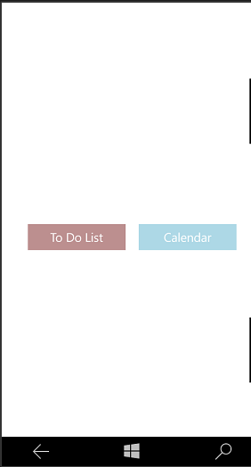
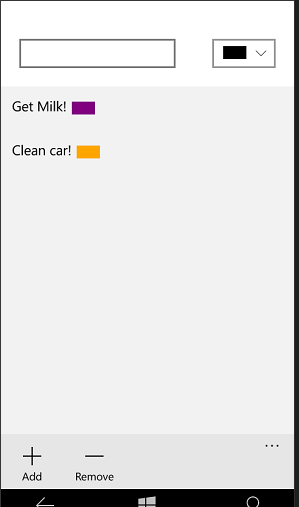
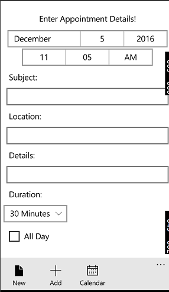

# Mobile Applications Project
###### Darren Fitz
###### G00311853

## Introduction
For this Universal Windows Platform (UWP), I deceided to make a type of utility app that allowed you to make a To-Do list or schedule appointments into your calendar on your phone. This app include a login feature thatutilises a SQLite database engine, which stores the name and password of the user.

##Technologies Used
+ UWP (Universal Windows Platform)
+ SQLite database
+ Observable Collection
+ Lambda
+ Async - Await

##How to use the Application
Here we see the main login Page. It's where you can sign in to app if you made an account. It compares the users entered text of a username and a password and checks if it matched with a corrisponding ones in the SQLite databse. If yo havent created a Username and Password you can do so in the RegisterPage. 

Then we have to a page with option of either a To-Do List or Appointment App . The button will direct you to either page. In the To-Do list you can add and delete the items you wish to achieve, All while choosing an approproiate colour to match the chosen goal. Appointment app creates an app on the phone and sadd it toy phone calendar. CLicking the add button will create an appointment in your calendar.

##Issues with the Application
For this app I couldn't get winUX imlemented. I wanted to use this to add the validation to my RegisterPage. It gave an error complaining that it couldnt find a validation control, so I left it out. 
