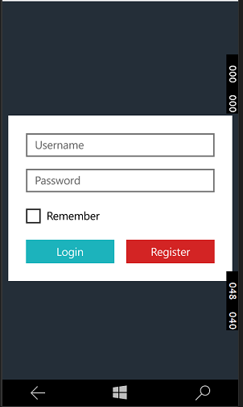
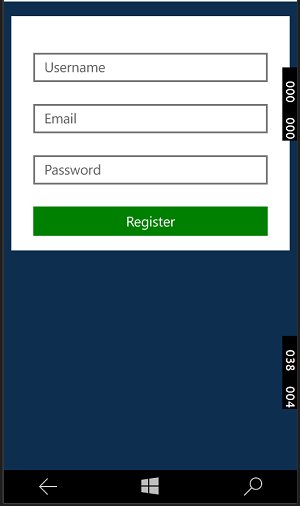

# Mobile Applications Project
###### Darren Fitz
####### G00311853

## Introduction
For this Universal Windows Platform (UWP), I deceided to make a type of utility app that allowed you to make a To-Do list or schedule appointments into your calendar on your phone. This app include a login feature thatutilises a SQLite database engine, which stores the name and password of the user.

##Technologies Used
+ UWP (Universal Windows Platform)
+ SQLite database
+ Observable Collection
+ Lambda
+ Async - Await

##How to use the Application
Here is the main login Page. It's where you can sign in to app if you made an account. It compares the users entered text of a username and a password and checks if it matched with a corrisponding ones in the SQLite databse.

